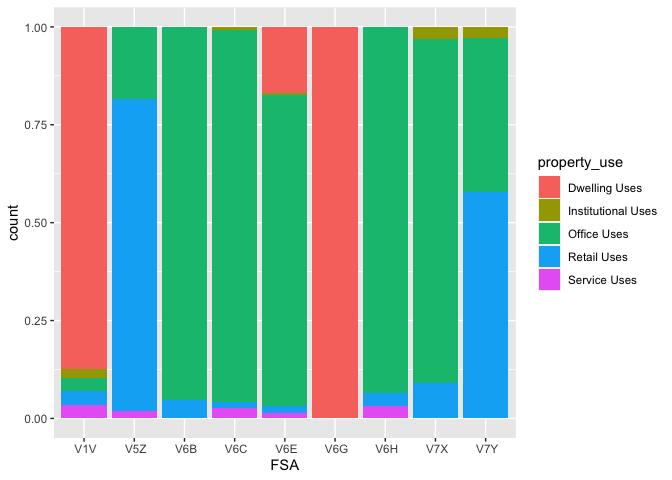
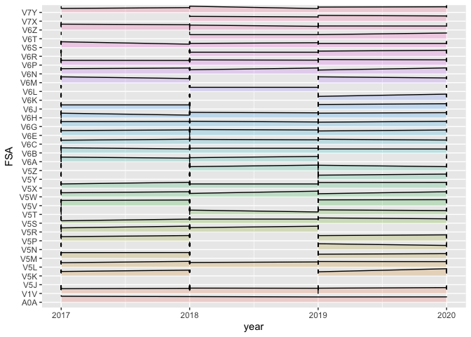
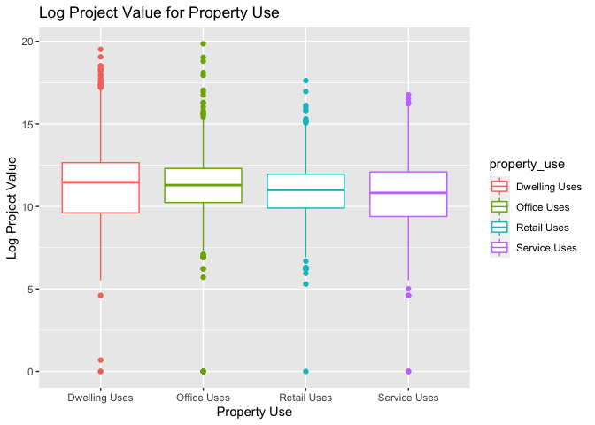

Mini Data Analysis Milestone 2
================

Begin by loading your data and the tidyverse package below:

``` r
library(datateachr) # <- might contain the data you picked!
library(tidyverse)
library(ggridges)
```

# Task 1: Process and summarize your data

From milestone 1, you should have an idea of the basic structure of your
dataset (e.g. number of rows and columns, class types, etc.). Here, we
will start investigating your data more in-depth using various data
manipulation functions.

### 1.1 Research Questions

1.  Is there a correlation between the building contractor and project
    value? Would that indicate the budget of the contractor?
2.  Can we see that some of buildings with certain postal code are more
    related to a certain specific use category?
3.  How did the project values change over time for regions with
    different postal code?
4.  Is there a relationship between project value and property use? eg.
    Does it cost more to build offices or houses?

### 1.2 Summarizing and Graphing

#### Question 1:

###### Is there a correlation between the building contractor and project value? Would that indicate the budget of the contractor?

``` r
#1. Compute the *range*, *mean*, and *two other summary statistics* of **one numerical variable** across the groups of **one categorical variable** from your data.
#2. Compute the number of observations for at least one of your categorical variables. Do not use the function `table()`!


length(unique(building_permits$building_contractor))
```

    ## [1] 2567

``` r
# As there are many contractors (2567), I will remove the NAs and subset the data to only work with contractors that have many projects (>50), and save the data as new variable


building_permits[building_permits == ""] <- NA


top_contract <- building_permits %>%
  drop_na(building_contractor) %>%
  add_count(building_contractor) %>%
  filter(n > 50) %>%
  select(-n) 

summary_top_contract = top_contract %>%
  group_by(building_contractor) %>%
  summarize(mean_projval = mean(project_value, na.rm = T),
            #range_projval = range(project_value, na.rm = T), printing min and max as it looks better
            median_projval = median(project_value, na.rm = T),
            min_projval = min(project_value, na.rm = T),
            max_projval = max(project_value, na.rm = T),
            sd_projval = sd(project_value, na.rm = T),
            num_proj = n()
            )

ggplot(summary_top_contract, 
       aes(x = log(mean_projval), #Taking log of project values because of skewness towards a large value (One point much larger than the rest of the bulk data)
           y = reorder(building_contractor, -mean_projval), #Ordering the contractors based on their project values)
           color= building_contractor)) +
  geom_point() +
  theme(legend.position = "none") +
  labs(title = "Log Mean Project Value of Building Contractors",
       x = "Log Mean Project Value",
       y = "Building Contractors")
```

<!-- -->

From this graph we can see that there are differences between the mean
project values of different contractors. Ledcor Construction Ltd. has
the highest mean project value 1.16317510^{7}

#### Question 2:

###### 2\. Can we see that some of buildings with certain postal code are more related to a certain specific use category?

``` r
#2. Compute the number of observations for at least one of your categorical variables. Do not use the function `table()`!
#3. Create a categorical variable with 3 or more groups from an existing numerical variable. 

building_permits2 <- building_permits %>%
  separate(address, c("adress", "PostalCode"), sep = "BC", remove = FALSE) %>% # create a new variable named PostalCode, separating the address column by BC
  select(-adress) #drop the other new created column

building_permits2[building_permits2 == ""] <- NA #Some of the addresses do not include Postal Code, so this column is empty in some cells, so here, I fill these with NA.

#Now selecting projects with PostalCode that has 30 or more buildings
top_postalcode <- building_permits2 %>%
  drop_na(PostalCode) %>%
  add_count(PostalCode) %>% #Computing number of observations
  filter(n > 30)

#Creating another categorical variable using postal codes, which is FSA [A forward sortation area (FSA) is a way to designate a geographical unit based on the first three characters in a Canadian postal code.](https://www.ic.gc.ca/eic/site/bsf-osb.nsf/eng/br03396.html)

top_postalcode =  top_postalcode %>% 
  mutate(FSA = substr(PostalCode,1,4)) 

top_postalcode %>%
  group_by(FSA) %>%
  summarise(n())
```

    ## # A tibble: 9 × 2
    ##   FSA    `n()`
    ##   <chr>  <int>
    ## 1 " V1V"   843
    ## 2 " V5Z"    58
    ## 3 " V6B"    46
    ## 4 " V6C"   119
    ## 5 " V6E"   227
    ## 6 " V6G"    88
    ## 7 " V6H"    32
    ## 8 " V7X"    33
    ## 9 " V7Y"   113

``` r
sub_top_postalcode = top_postalcode %>% #Since there are so many categories for property categories, I am only using the top 5 with highest property number.
  group_by(property_use) %>%
  drop_na(property_use) %>%
  summarise(n= n()) %>%
  arrange(desc(n)) %>%
  top_n(5) 
```

    ## Selecting by n

``` r
sub_top_postalcode = as_vector(sub_top_postalcode$property_use)

top_postalcode = top_postalcode %>%
  filter(property_use %in% sub_top_postalcode)

ggplot(top_postalcode, aes(
  x = FSA, 
  fill = property_use)) +
  geom_bar(position = "fill")
```

<!-- -->

Properties in V1V and V6G are mainly used for Dwelling, and properties
in V5Z and V7Y are mainly used for Retail. The rest has mainly office
buildings.

#### Question 3:

###### 3\. How did the project values change over time for regions with different postal code?

``` r
#2. Compute the number of observations for at least one of your categorical variables. Do not use the function `table()`!
#3. Create a categorical variable with 3 or more groups from an existing numerical variable. You can use this new variable in the other tasks! *An example: age in years into "child, teen, adult, senior".*


projvalVStime <- building_permits %>%
  drop_na(project_value) %>%
  mutate(Budget = ifelse(project_value %in% 0:10000, "low",
                         ifelse(project_value %in% 10000:50000, "medium",
                                "high"))) 
projvalVStime %>%
  group_by(Budget) %>%
  summarise(n())
```

    ## # A tibble: 3 × 2
    ##   Budget `n()`
    ##   <chr>  <int>
    ## 1 high    9903
    ## 2 low     5124
    ## 3 medium  5601

``` r
projvalVStime <- projvalVStime %>% #Since there are so many postal codes, I will continue to work with FSA
  separate(address, c("adress", "PostalCode"), sep = "BC", remove = FALSE) %>%
  select(-adress) %>%
  mutate(PostalCode = na_if(PostalCode, "")) %>%
  #mutate(project_value = replace(project_value, project_value == 0, NA ))
  drop_na(PostalCode,project_value) %>%
  mutate(FSA = substr(PostalCode,1,4))

top_FSA <- #Filtering for FSA that has values for at least 1  year
   projvalVStime %>% 
   group_by(FSA) %>%
   count(year) %>% 
   filter(n > 1) 

top_FSA <- as_vector(unique(top_FSA$FSA)) #Getting the FSA as vector

sub_projvalVStime <- projvalVStime %>% #Filtering the dataframe 
  filter(FSA %in% top_FSA)

ggplot(sub_projvalVStime, aes(
  x = year,
  y = FSA,
  height = scales::rescale(log(project_value)),
  fill = FSA)) +
  geom_ridgeline(alpha = .2) +
  theme(legend.position = "none")
```

<!-- -->

For most of the FSA, the project values did not change much over the
years.

#### Question 4:

###### 4\. Is there a relationship between project value and property use? eg. Does it cost more to build offices or houses?

``` r
#1. Compute the *range*, *mean*, and *two other summary statistics* of **one numerical variable** across the groups of **one categorical variable** from your data.
#2. Compute the number of observations for at least one of your categorical variables. Do not use the function `table()`!


ProjvsPropUse <- building_permits %>%
  drop_na(property_use,project_value)%>%
  group_by(property_use) %>%
  mutate(mean_projval = mean(project_value, na.rm = T),
            median_projval = median(project_value, na.rm = T),
            min_projval = min(project_value, na.rm = T),
            max_projval = max(project_value, na.rm = T),
            num_proj = n()
            ) %>%
  filter(num_proj > 10)

#Since there are so many categories for property_use, I will subset the data:
propUse <- c("Dwelling Uses", "Office Uses", "Retail Uses", "Service Uses")

ProjvsPropUse <- ProjvsPropUse %>%
  filter( property_use %in% propUse) %>%
  filter(project_value != 0)

ggplot(ProjvsPropUse, aes(x = property_use, y = log(project_value), color = property_use)) +
  geom_boxplot() +
  labs(title = "Log Project Value for Property Use",
       x = "Property Use",
       y = "Log Project Value")
```

<!-- -->

The cost of buildings with different types of uses are more or less the
same, and there is large variation with many outliers in each group.

### 1.3 Summary

1.  Is there a correlation between the building contractor and project
    value? Would that indicate the budget of the contractor?

I think I am close to answer this question. From the graph, I can see
that many building contractors have similar project values but some has
significantly different, which can indicate budgets. But this graph only
shows mean so maybe it could be better to look other statistics. From
here, I can compare the distributions of the project values of the top n
contractors.

2.  Can we see that some of buildings with certain postal code are more
    related to a certain specific use category?

When grouped by FSA, the number of buildings with some specific use are
higher than the others, in some regions the number of buildings for
dwelling is higher, whereas in others there are more buildings for
offices. I think I could sufficiently answer this question.

3.  How did the project values change over time for regions with
    different postal code?

For most of the regions grouped by FSA, the project value doesnt change
much, and for some of them we dont have data in certain years. It could
be interesting to select top FSAs with most projects and see how the
project values change over time.

4.  Is there a relationship between project value and property use? eg.
    Does it cost more to build offices or houses?

I used boxplots to compare the project values for different property
values. For dwelling, the variation is much higher than rest, and for
offices there are a few outliers. Maybe I can look more into this
question by grouping the data by postal code?

# Task 2: Tidy your data (12.5 points)

A reminder of the definition of *tidy* data:

  - Each row is an **observation**
  - Each column is a **variable**
  - Each cell is a **value**

### 2.1 Is my data tidy?

Based on the definition above, my data is somewhat tidy, because every
row is an observation. Since I have more than 8 columns, I am subsetting
the data to work on:

1)permit\_number 2)issue\_date 3)project\_value 4)type\_of\_work
5)address 6)building\_contractor 7)property\_use 8)year

``` r
#Subsetting the columns:
building_permits <- building_permits %>%
  select(c(permit_number,
          issue_date,
          project_value,
          type_of_work,
          address,
          building_contractor,
          property_use,
          year)) 

head(building_permits)
```

    ## # A tibble: 6 × 8
    ##   permit_number issue_date project_value type_of_work  address  building_contra…
    ##   <chr>         <date>             <dbl> <chr>         <chr>    <chr>           
    ## 1 BP-2016-02248 2017-02-01             0 Salvage and … 4378 W … <NA>            
    ## 2 BU468090      2017-02-01             0 New Building  1111 RI… <NA>            
    ## 3 DB-2016-04450 2017-02-01         35000 Addition / A… 3732 W … <NA>            
    ## 4 DB-2017-00131 2017-02-01         15000 Addition / A… 88 W PE… Mercury Contrac…
    ## 5 DB452250      2017-02-01        181178 New Building  492 E 6… 0820163 BC Ltd  
    ## 6 BP-2016-01458 2017-02-02             0 Salvage and … 3332 W … <NA>            
    ## # … with 2 more variables: property_use <chr>, year <dbl>

### 2.2 Tidy/Untidy your data

Each row is an observation in my data, so because of this, if I make
another row for each observation then my data would be untidy.

``` r
#Creating a new Postal Code column
building_permits <- building_permits %>%
  separate(address, c("adress2", "PostalCode"), sep = "BC", remove = FALSE) %>%
  select(-adress2)

building_permits_untidy <- building_permits %>%
  pivot_longer(cols=c(address, PostalCode),
               names_to = c("location_type"),
               values_to= c("location"))

#This made my data untidy, because now I have 2 rows for each observation and I have duplicated info, since postal code is also included in the address. Now tidying it back:

building_permits_tidy1 <- building_permits_untidy %>%
  pivot_wider(names_from = location_type,
              values_from = location)

#Now I have 1 row per observation again, with address and postal code given as columns.
```

### 2.3 (5 points)

Now, you should be more familiar with your data, and also have made
progress in answering your research questions. Based on your interest,
and your analyses, pick 2 of the 4 research questions to continue your
analysis in milestone 3, and explain your decision.

Try to choose a version of your data that you think will be appropriate
to answer these 2 questions in milestone 3. Use between 4 and 8
functions that we’ve covered so far (i.e. by filtering, cleaning,
tidy’ing, dropping irrelevant columns, etc.).

For milestone 3, I choose to proceed with Question 1 and Question 4. For
question 1, I only compared the mean project values of the contractors,
so it could be more insightful to look at the distribution of project
values, since mean can be effected by outliers. In Question 4, I want to
also include the postal code(FSA) in my analysis, because it can effect
the project value and bias the results. I can do random sampling or
group the results by postal code.

To proceed, I want to make my data clean for further analysis:

``` r
#Some addresses don't include postal code so the cells are empty, I fill these cells with NA and then remove the rows containing NAs.
building_permits_tidy1[building_permits_tidy1 == ""] <- NA

building_permits_tidy2 <- building_permits_tidy1 %>%
  drop_na() %>%
  filter(project_value != 0 ) %>% #Also filtering rows with project values = 0
  select(-address) #Since I have the postal code column, I can remove the address column.

#Before  
head(building_permits_tidy1)
```

    ## # A tibble: 6 × 9
    ##   permit_number issue_date project_value type_of_work          building_contrac…
    ##   <chr>         <date>             <dbl> <chr>                 <chr>            
    ## 1 BP-2016-02248 2017-02-01             0 Salvage and Abatement <NA>             
    ## 2 BU468090      2017-02-01             0 New Building          <NA>             
    ## 3 DB-2016-04450 2017-02-01         35000 Addition / Alteration <NA>             
    ## 4 DB-2017-00131 2017-02-01         15000 Addition / Alteration Mercury Contract…
    ## 5 DB452250      2017-02-01        181178 New Building          0820163 BC Ltd   
    ## 6 BP-2016-01458 2017-02-02             0 Salvage and Abatement <NA>             
    ## # … with 4 more variables: property_use <chr>, year <dbl>, address <chr>,
    ## #   PostalCode <chr>

``` r
#After
head(building_permits_tidy2)
```

    ## # A tibble: 6 × 8
    ##   permit_number issue_date project_value type_of_work          building_contrac…
    ##   <chr>         <date>             <dbl> <chr>                 <chr>            
    ## 1 DB-2017-00131 2017-02-01         15000 Addition / Alteration Mercury Contract…
    ## 2 DB452250      2017-02-01        181178 New Building          0820163 BC Ltd   
    ## 3 BP-2016-03697 2017-02-02         25000 Addition / Alteration RenBui Construct…
    ## 4 BP-2016-04117 2017-02-02         25750 Addition / Alteration AG Electric and …
    ## 5 BP-2017-00154 2017-02-02         44000 Addition / Alteration Anthony Minniti  
    ## 6 DB-2016-02047 2017-02-02        200000 Addition / Alteration PD Moore Homes I…
    ## # … with 3 more variables: property_use <chr>, year <dbl>, PostalCode <chr>

### Attribution

Thanks to Victor Yuan for mostly putting this together.
